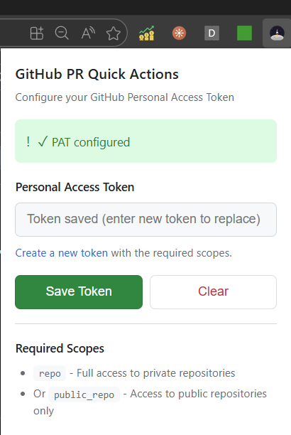
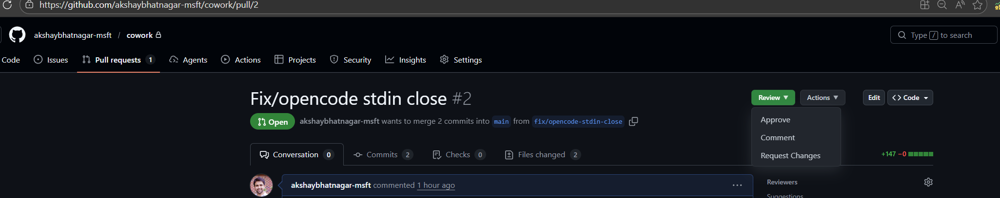

# GitHub PR Quick Actions

A Chrome extension that adds quick-action buttons to GitHub pull request pages for common operations that are typically buried in submenus.

## Features

- **Review Dropdown** - Submit reviews with a single click
  - Approve
  - Comment
  - Request Changes
  - Opens a modal for adding optional/required comments

- **Actions Dropdown** - Common PR operations
  - Squash & Merge
  - Enable/Disable Auto-Merge (toggles based on current state)
  - Close PR

- **Comment Count** - Displays the number of review comments across all files

- **Dark Mode Support** - Matches GitHub's theme automatically

## Installation

1. Clone or download this repository
2. Open Chrome and navigate to `chrome://extensions`
3. Enable **Developer mode** (toggle in top-right)
4. Click **Load unpacked**
5. Select the repository folder

## Configuration

### Step 1: Add Your Personal Access Token

Click the extension icon in the Chrome toolbar to open the configuration popup.


1. Generate a GitHub Personal Access Token at https://github.com/settings/tokens/new
   - Required scope: `repo` (for private repositories) or `public_repo` (for public only)
   - If your organization uses SAML SSO, authorize the token for your org after creation
2. Paste the token and click **Save Token**

Once saved, the status will show "PAT configured":



### Step 2: Use the Quick Actions

Navigate to any GitHub pull request page. The **Review** and **Actions** buttons will appear in the PR header area:



- **Review** - Click to open dropdown with Approve, Comment, Request Changes options
- **Actions** - Click to open dropdown with Squash & Merge, Auto-Merge, Close PR options

## Security

### How the Token is Stored

The Personal Access Token is stored using `chrome.storage.sync`:

```javascript
// Storage
chrome.storage.sync.set({ githubPAT: token });

// Retrieval
chrome.storage.sync.get(['githubPAT']);
```

### Security Properties

| Protection | Status |
|------------|--------|
| Other extensions cannot access it | Yes - Chrome isolates storage by extension ID |
| Websites/page scripts cannot access it | Yes - Storage API not exposed to web pages |
| Encrypted in transit (sync) | Yes - When syncing across devices |
| Encrypted at rest on disk | **No** - Stored in plain text in Chrome profile |

### Threat Model

**Protected against:**
- Malicious websites trying to steal your token
- Other browser extensions accessing your data
- Network interception (when syncing)

**NOT protected against:**
- Malware with user-level access on your system (can read Chrome's storage files directly from `~/.config/google-chrome/` on Linux or `%LOCALAPPDATA%\Google\Chrome\` on Windows)
- Physical access to your unlocked computer
- Extensions with `debugger` permission that could inspect your extension
- Token syncing to other devices where you're signed into Chrome

### Recommendations

- Use a token with minimal required scopes (`public_repo` if you only work with public repos)
- Regularly rotate your token
- If you don't need cross-device access, consider that the token syncs to all Chrome instances
- Be cautious about what other software you install on your system

### Alternatives Considered

| Approach | Trade-off |
|----------|-----------|
| `chrome.storage.local` instead of `sync` | Keeps token on one machine only, but still unencrypted |
| Session-only storage | More secure, but requires re-entering token each session |
| OAuth App flow | More secure, but requires registering a GitHub OAuth app |
| Encrypt before storing | Where do you store the encryption key? (Chicken-and-egg problem) |

## Files

| File | Description |
|------|-------------|
| `manifest.json` | Extension configuration (Manifest V3) |
| `background.js` | Service worker handling GitHub API calls |
| `content.js` | DOM injection and UI logic |
| `content.css` | Styling (GitHub Primer-inspired) |
| `popup.html` | PAT configuration popup UI |
| `popup.js` | Popup logic and token validation |

## API Endpoints Used

| Action | Method | Endpoint |
|--------|--------|----------|
| Submit Review | POST | `/repos/{owner}/{repo}/pulls/{pull_number}/reviews` |
| Close PR | PATCH | `/repos/{owner}/{repo}/pulls/{pull_number}` |
| Squash & Merge | PUT | `/repos/{owner}/{repo}/pulls/{pull_number}/merge` |
| Enable Auto-Merge | GraphQL | `enablePullRequestAutoMerge` mutation |
| Disable Auto-Merge | GraphQL | `disablePullRequestAutoMerge` mutation |
| Get PR Details | GraphQL | Query for auto-merge status and comment counts |

## License

MIT
